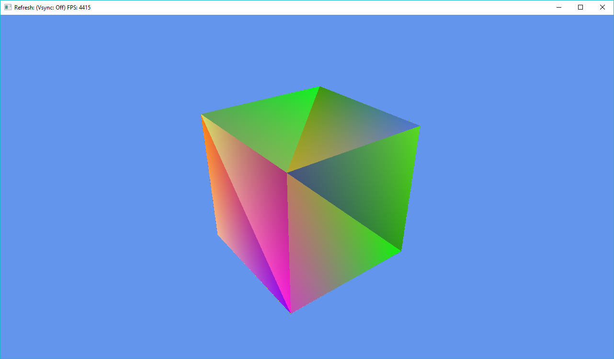

# opentk-minimal
C# OpenTK minimal project setup for quick start

After cloning this repository into Visual Studio, you should run

```
Install-Package OpenTK -Version 2.0.0
```

In NuGet to install the OpenTK libraries for the project locally.

Once up and running you should see something like this


